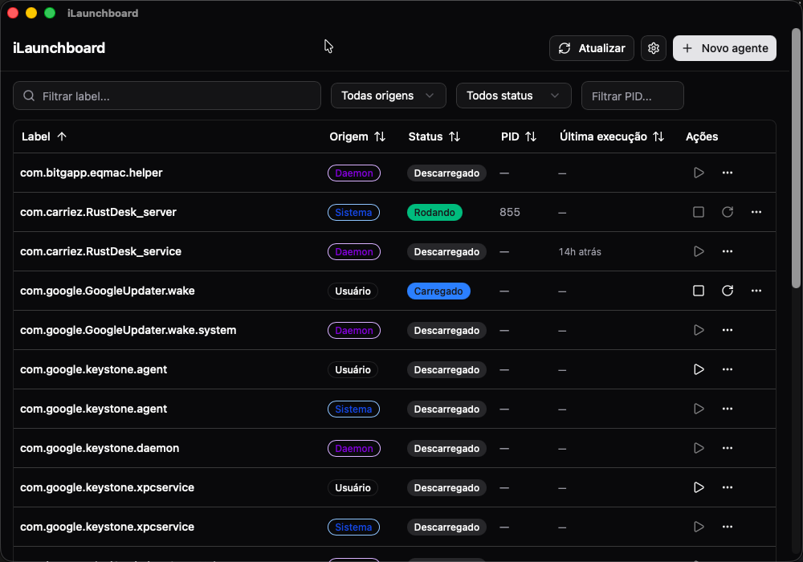

<div align="center">
  

  <h1>iLaunchboard</h1>

  <p><strong>Uma interface visual para gerenciar LaunchAgents e LaunchDaemons do macOS.</strong></p>
  <p>Veja, filtre, inspecione, carregue, descarregue e crie agentes do <code>launchd</code> sem decorar comandos nem editar <code>.plist</code> na mão.</p>

  <p>
    
    
    
    
  </p>
</div>

---

<p align="center">
  
</p>

---

## 🧭 O problema

O `launchd` é o coração dos serviços e tarefas agendadas no macOS. Ele controla `LaunchAgents`, `LaunchDaemons`, jobs carregados no login, tarefas com intervalo, scripts com `StartCalendarInterval` e muito mais. O problema é que a experiência padrão é espalhada entre arquivos `.plist`, pastas como `~/Library/LaunchAgents/`, `/Library/LaunchAgents/`, `/Library/LaunchDaemons/` e comandos como `launchctl list`, `bootstrap`, `bootout` e `kickstart`.

Pra quem usa automações no Mac, isso vira rápido uma mistura de terminal, Finder, editor de plist e tentativa-e-erro.

## ✨ A solução

iLaunchboard é um app desktop que coloca seus jobs do `launchd` numa interface visual. Você consegue listar agentes de usuário, agentes do sistema e daemons, filtrar por label/status/origem/PID, ordenar colunas, ver detalhes do plist, abrir logs, revelar o arquivo no Finder e executar ações comuns em agentes do usuário.

Por segurança, **System Agents e System Daemons são somente leitura**. Ações que modificam estado ou arquivo ficam limitadas a `~/Library/LaunchAgents/`.

## 🎯 Features

- 🔎 **Tabela filtrável** — filtre por label, origem, status e PID
- ↕️ **Ordenação por coluna** — ordene por Label, Source, Status, PID e Last Run
- 🟢 **Ações rápidas** — Load, Unload, Restart e Test Run para User Agents
- 🧾 **Detalhes do plist** — veja argumentos, schedule, paths de log, working directory e variáveis de ambiente
- 🛠️ **Editor/criador de agentes** — crie e edite `LaunchAgents` de usuário pela interface
- ⏱️ **Preview de agendamento** — veja próximas execuções para intervalos e calendários
- 📜 **Visualizador de logs** — abra, atualize e limpe stdout/stderr configurados
- 🌗 **Tema configurável** — claro, escuro ou igual ao sistema
- 🌍 **Idioma configurável** — inglês por padrão, português disponível
- 📁 **Reveal in Finder** — abra o `.plist` direto no Finder

## 📦 Instalação

1. Baixe o `.dmg` da página de [Releases](https://github.com/fredwilliamtjr/iLaunchboard/releases)
2. Monte o DMG e arraste o `iLaunchboard.app` pra pasta **Applications**
3. Primeira abertura: clique com **botão direito → Abrir** (o Gatekeeper pode reclamar porque o app não é assinado com Developer ID)
4. Se o macOS insistir que "o app está danificado":
   ```bash
   xattr -dr com.apple.quarantine /Applications/iLaunchboard.app
   ```

> **Permissões:** o app lê arquivos em `~/Library/LaunchAgents/`, `/Library/LaunchAgents/` e `/Library/LaunchDaemons/`. Para modificar agentes, ele trabalha apenas com User Agents do seu usuário.

## ⚙️ Como usar

1. Abra o iLaunchboard
2. Use a busca e os filtros para encontrar um agente por label, origem, status ou PID
3. Clique em uma linha para ver detalhes do `.plist`
4. Em User Agents, use Load/Unload/Restart/Test Run quando precisar
5. Clique em **New Agent** para criar um novo agente em `~/Library/LaunchAgents/`
6. Use **Settings** para escolher tema e idioma

## 🧱 Arquitetura

```
iLaunchboard/
├── src/                   # Frontend React + TypeScript
│   ├── components/         # Telas, tabela, formulário, detalhes e componentes UI
│   ├── hooks/              # Hooks de jobs/logs
│   ├── lib/                # Invoke wrappers, i18n, settings e utilitários
│   └── test-utils/         # Fake Tauri IPC para testes
├── src-tauri/              # Backend Rust + configuração Tauri
│   ├── src/                # launchctl wrapper, parser de plist e comandos Tauri
│   └── icons/              # Ícones do app em PNG/ICNS/ICO
├── assets/                 # Assets usados no README
└── docs/                   # Ícone e screenshot do README
```

| Componente | Responsabilidade |
|---|---|
| `launchctl.rs` | Wrapper dos comandos `launchctl list`, `bootstrap`, `bootout`, `kickstart`, `enable` e `disable` |
| `plist_util.rs` | Varre diretórios de agents/daemons, lê plist XML/binário e escreve plist |
| `commands.rs` | Comandos expostos ao frontend pelo Tauri |
| `useJobs` | Carrega jobs, aplica filtros de label/source/status/PID e refresh |
| `JobList` | Tabela com ordenação por coluna e ações por linha |
| `JobForm` | Criação/edição de User Agents com preview de schedule |
| `LogViewer` | Lê, atualiza, limpa e abre arquivos de log |
| `i18n.tsx` | Idiomas inglês/português e labels de status/origem |
| `settings.ts` | Persistência de tema/idioma e sincronização com tema do macOS |

## 🔨 Build a partir do código

Requisitos:
- macOS
- Node.js + pnpm
- Rust/Cargo
- Xcode Command Line Tools

```bash
git clone https://github.com/fredwilliamtjr/iLaunchboard.git
cd iLaunchboard
pnpm install
pnpm tauri:dev
```

Frontend apenas:

```bash
pnpm dev
```

Gerar app/DMG:

```bash
pnpm tauri:build
```

## ✅ Testes e lint

```bash
pnpm test
pnpm lint
pnpm typecheck

cargo test --manifest-path src-tauri/Cargo.toml
cargo fmt --manifest-path src-tauri/Cargo.toml --check
cargo clippy --manifest-path src-tauri/Cargo.toml -- -D warnings
```

## 🔒 Segurança

- **System Agents e System Daemons são read-only** na interface
- **Start/Stop/Restart/Test Run** ficam restritos a User Agents
- **Criação e edição** escrevem em `~/Library/LaunchAgents/`
- O app não pede senha de admin para mexer em daemons do sistema
- O backend Rust chama `launchctl` diretamente, em vez de expor shell genérico ao frontend
- Logs só são lidos/limpos quando o plist aponta para um caminho configurado

## 🚫 Limitações conhecidas

- Não edita System Agents nem System Daemons
- Não substitui ferramentas avançadas como LaunchControl para debugging profundo
- Alguns plists com chaves muito específicas podem aparecer parcialmente na visão estruturada
- App ainda não é assinado/notarizado com Developer ID
- Distribuição inicial é voltada para Apple Silicon

## 🗺️ Roadmap

- [x] Rebrand para iLaunchboard
- [x] Tema claro/escuro/sistema
- [x] Idiomas inglês e português
- [x] Filtros por label/source/status/PID
- [x] Ordenação por coluna
- [x] Ícone próprio
- [x] DMG distribuível
- [ ] Assinatura e notarização com Developer ID
- [ ] Tela de diff/preview antes de salvar plist editado
- [ ] Export/import de agentes
- [ ] Histórico de execuções mais detalhado
- [ ] Auto-update

## 🌱 Origem

Este projeto é baseado no [azu/launchd-ui](https://github.com/azu/launchd-ui), originalmente publicado sob licença MIT.

## 📄 Licença

MIT

---

<div align="center">
  <sub>Feito com ☕ por <a href="https://github.com/fredwilliamtjr">@fredwilliamtjr</a></sub>
</div>
